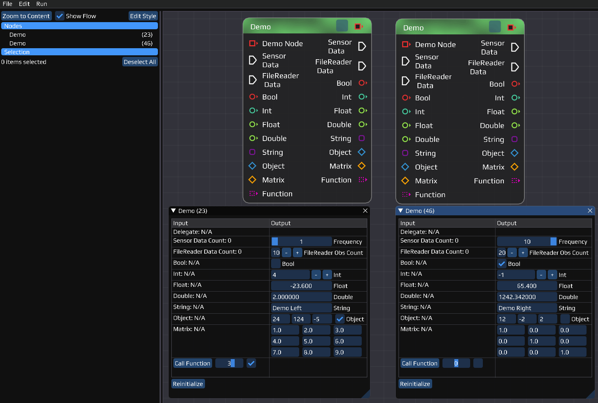

# INSTINCT - INS Toolkit for Integrated Navigation Concepts and Training

Navigation Software of the Institut of Navigation (University of Stuttgart)



## Description

This software provides real-time and post processing functionality for navigational tasks. It can read from sensors and fuse together the data. It can fuse GNSS data with IMU data and do advanced functions like RTK, RAIM, ...

The software consists of one executable ```instinct```
* It spawns a GUI on default where you can edit your flow
* If now GUI is required, the application can be run in ```--nogui``` mode and a `.flow` file can be loaded manually

## Getting Started

### Working with the Repository

##### Git (either clone or update)
- Clone the repository
  ```
  git clone --recurse-submodules https://git.nav.uni-stuttgart.de/thomas.topp/instinct.git INSTINCT
  ```
- Update the repository
  ```
  git pull --recurse-submodules
  ```

##### Cmake
```shell
export CC=clang && export CXX=clang++ && cmake -Bbuild/Release -S. -DCMAKE_BUILD_TYPE=Release -DENABLE_MAIN=ON -DENABLE_TESTING=OFF -DENABLE_DOXYGEN=OFF -DENABLE_CLANG_TIDY=OFF -DENABLE_CPPCHECK=OFF -DLOG_LEVEL=INFO
```
##### Build
```shell
cmake --build build/Release -- -j
```

##### Run the executable
```shell
./bin/Release/instinct -f config.ini -l flow/Default.flow
```

##### Build the documentation
```shell
cmake -Bbuild/Release -S. -DCMAKE_BUILD_TYPE=Release -DENABLE_MAIN=OFF -DENABLE_TESTING=OFF -DENABLE_DOXYGEN=ON -DLOG_LEVEL=OFF -DENABLE_CLANG_TIDY=OFF -DENABLE_CPPCHECK=OFF -DENABLE_INCLUDE_WHAT_YOU_USE=OFF -DDOC_CHECK_CODE_DOCUMENTATION=NO
cmake --build build/Release --target doc
```
The doxygen main page can then be opened under `bin/doc/html/index.html`

##### Help message

```
INSTINCT 0.2.0 - INS Toolkit for Integrated Navigation Concepts and Training

Allowed options:
  -f [ --config ] arg   List of configuration files to read parameters from
  -v [ --version ]      Display the version number
  -h [ --help ]         Display this help message
  --sigterm             Programm waits for -SIGUSR1 / -SIGINT / -SIGTERM
  --duration arg (=0)   Program execution duration [sec]
  --nogui               Launch without the gui
  -l [ --load ] arg     Flow file to load
```

### Development Environment Setup

Most library dependencies are managed by Conan.io, so you just need to install the basics.

#### ArchLinux
```shell
# Needed
sudo pacman -S base-devel cmake clang glfw-x11
trizen -S conan # AUR package

# Documentation
sudo apt install -y doxygen pdf2svg texlive-most ghostscript

# Optional
sudo pacman -S ccache cppcheck

# Profiling (optional)
sudo pacman -S valgrind kcachegrind
```

#### Ubuntu 20.04
```shell
# Needed
sudo apt update
sudo apt upgrade -y
sudo apt install -y build-essential clang clang-tidy cmake python3-pip libglfw3-dev libglfw3
sudo apt install -y gcc-10 g++-10
sudo ln -sf /usr/bin/gcc-10 /usr/bin/gcc
sudo ln -sf /usr/bin/g++-10 /usr/bin/g++
sudo apt install -y clang-12 clang-tidy-12
sudo ln -sf /usr/bin/clang-12 /usr/bin/clang
sudo ln -sf /usr/bin/clang++-12 /usr/bin/clang++
sudo ln -sf /usr/bin/clang-tidy-12 /usr/bin/clang-tidy
pip3 install conan --user

# Documentation (Ubuntu 20.04 has too old doxygen version)
sudo apt install -y pdf2svg texlive texlive-lang-german texlive-latex-extra ghostscript
sudo apt install -y flex bison graphviz mscgen dia # Build dependencies
wget -c https://www.doxygen.nl/files/doxygen-1.9.2.src.tar.gz -O - | tar -xz
mkdir doxygen-1.9.2/build && cd doxygen-1.9.2/build
cmake -G "Unix Makefiles" .. && make && sudo make install

# Optional
sudo apt install ccache cppcheck

# Profiling (optional)
sudo apt install valgrind kcachegrind
```

#### MacOS
```shell
# Basic
xcode-select --install
/bin/bash -c "$(curl -fsSL https://raw.githubusercontent.com/Homebrew/install/master/install.sh)"
brew update

# Needed
brew install cmake llvm conan glfw3
ln -s "$(brew --prefix llvm)/bin/clang-format" "/usr/local/bin/clang-format"
ln -s "$(brew --prefix llvm)/bin/clang-tidy" "/usr/local/bin/clang-tidy"

# Documentation
brew install doxygen pdf2svg
# Also latex is needed to compile the formulas

# Optional
brew install ccache cppcheck
```

#### Windows 10 (WSL)
[Windows Subsystem for Linux Installation Guide for Windows 10](https://docs.microsoft.com/de-de/windows/wsl/install-win10):

PowerShell (Administrator):
```shell
dism.exe /online /enable-feature /featurename:Microsoft-Windows-Subsystem-Linux /all /norestart

dism.exe /online /enable-feature /featurename:VirtualMachinePlatform /all /norestart
```
* Restart your computer
* Download & Install the Linux kernel update package [WSL2-Linux-Kernel for x64 computer](https://wslstorestorage.blob.core.windows.net/wslblob/wsl_update_x64.msi)
* Set WSL 2 as your default version: ```wsl --set-default-version 2```
* Next open the Microsoft Store and install [Ubuntu](https://www.microsoft.com/de-de/p/ubuntu/9nblggh4msv6)
* Launch Ubuntu and create a user account and password
* Follow the instructions for Ubuntu here in the Readme

[VSCode Developing in WSL](https://code.visualstudio.com/docs/remote/wsl):
* Install [Visual Studio Code](https://code.visualstudio.com/download) on the Windows side (not in WSL)
* Install the [Remote Development extension pack](https://aka.ms/vscode-remote/download/extension)
* Navigate with Linux terminal to your source code folder and type ```code .```

[Get the GUI to work](https://github.com/microsoft/WSL/issues/4793#issuecomment-577232999):
* In Ubuntu install a new [OpenGL Version](https://launchpad.net/~oibaf/+archive/ubuntu/graphics-drivers/):
```shell
sudo add-apt-repository ppa:oibaf/graphics-drivers
sudo apt-get update
sudo apt-get upgrade -y
sudo apt purge mesa-vulkan-drivers
```
* Install [VcXsrv](https://sourceforge.net/projects/vcxsrv/) in Windows
* Run with these settings:
    * Multiple windows, Display number: -1
    * Start no client
    * Extra Settings
        * [ ] Native opengl
        * [x] Disable access control
* Hover with your mouse over the system tray icon and verify that it says ```hostname:0.0```
* Find your host IP address (run in windows console: ```ipconfig```), e.g. 192.168.1.3
* In the ```.bashrc``` add the following and replace the ip address there:
```
export DISPLAY=192.168.1.3:0.0
```
* Restart your computer

### VSCode Configuration

#### Task overview

|  Hotkey  | Action                                    | Default       |
| :------: | :---------------------------------------- | ------------- |
| ```F5``` | Debug the project                         | Default debug |
| ```F6``` | Run Task: ```MAIN: Build project```       | Default build |
| ```F7``` | Run Task: ```MAIN: Build & run project``` | Default test  |
| ```F8``` | Open Task List                            |               |

* To start the GUI, execute the Task ```MAIN: Build & run project```
* If you have problems with the build, execute the Task ```CLEAN: Remove build files```
* If you want to provide tests, place them in the ```tests``` directory and execute them with the task ```TEST: Build & run```

#### Extensions

It is strongly recommended to use [Visual Studio Code](https://code.visualstudio.com/) as IDE, as the needed project files are provided in the ```.vscode``` folder.

Recommended plugins for working with this project
* [C/C++](https://marketplace.visualstudio.com/items?itemName=ms-vscode.cpptools): C/C++ IntelliSense, debugging, and code browsing.
* [CMake](https://marketplace.visualstudio.com/items?itemName=twxs.cmake): CMake langage support for Visual Studio Code
* [Doxygen Documentation Generator](https://marketplace.visualstudio.com/items?itemName=cschlosser.doxdocgen): Automatic Doxygen generation by typing ```/// + [Enter]```
* [Todo Tree](https://marketplace.visualstudio.com/items?itemName=Gruntfuggly.todo-tree): Show TODO, FIXME, etc. comment tags in a tree view
* [Code Spell Checker](https://marketplace.visualstudio.com/items?itemName=streetsidesoftware.code-spell-checker): Spelling checker for source code
* [Log File Highlighter](https://marketplace.visualstudio.com/items?itemName=emilast.LogFileHighlighter): Adds color highlighting to log files to make it easier to follow the flow of log events and identify problems.
* [Clang-Tidy](https://marketplace.visualstudio.com/items?itemName=notskm.clang-tidy) Integrates clang-tidy into VS Code
* [cmake-format](https://marketplace.visualstudio.com/items?itemName=cheshirekow.cmake-format) Format listfiles so they don't look like crap
* [mathover](https://marketplace.visualstudio.com/items?itemName=Remisa.mathover) Render LaTeX comments on hover
* [Status Bar Parameter](https://marketplace.visualstudio.com/items?itemName=mschababerle.status-bar-param) Add selectable parameter to the status bar

#### Settings

Recommended changes to the User's ```settings.json``` (**not** the project .vscode/settings.json)
```
"editor.formatOnType": true,
"doxdocgen.generic.authorEmail": "your.name@ins.uni-stuttgart.de",
"doxdocgen.generic.authorName": "Y. Name",
```

Recommended changes to the User's ```keybindings.json```
```
[
    {
        "key": "f6",
        "command": "workbench.action.tasks.build",
        "when": "!inDebugMode"
    },
    {
        "key": "f8",
        "command": "-editor.action.marker.nextInFiles",
        "when": "editorFocus && !editorReadonly"
    },
    {
        "key": "f8",
        "command": "workbench.action.tasks.runTask"
    },
    {
        "key": "f7",
        "command": "workbench.action.tasks.test"
    }
]
```

## Dependencies

* Needed:
    * [cmake](https://cmake.org/) A cross-platform open-source make system
    * C++ compiler ([clang](https://clang.llvm.org/) or [gcc](https://gcc.gnu.org/) is recommended, but others work as well) for compiling the project
* Optional:
    * [Conan](https://conan.io) A distributed, open source, C/C++ package manager
    * [clang-format](https://clang.llvm.org/docs/ClangFormat.html) Code formatting Tool
    * [ccache](https://ccache.dev/) Compiler cache that speeds up recompilation by caching previous compilations
    * [valgrind](http://valgrind.org/) CPU profiling & leak detection
    * [kcachegrind](http://kcachegrind.sourceforge.net) Visualization of Performance Profiling Data
    * [doxygen](http://www.doxygen.nl/) Documentation system for C++, C, Java, IDL and PHP
    * [clang-tidy](https://clang.llvm.org/extra/clang-tidy/) Clang-based C++ "linter" tool
    * [cppcheck](http://cppcheck.sourceforge.net/) A tool for static C/C++ code analysis
* Libraries (Install yourself and change cmake link targets or let them automatically be installed by Conan):
    * [spdlog](https://github.com/gabime/spdlog) Fast C++ logging library [](https://opensource.org/licenses/MIT)
    * [fmt](https://github.com/fmtlib/fmt) A modern formatting library [](https://opensource.org/licenses/MIT)
    * [Boost](https://www.boost.org/) Free peer-reviewed portable C++ source libraries [](https://www.boost.org/LICENSE_1_0.txt)
    * [Eigen](http://eigen.tuxfamily.org) C++ template library for linear algebra: matrices, vectors, numerical solvers, and related algorithms [](https://opensource.org/licenses/MPL-2.0)
    * [Catch2](https://github.com/catchorg/Catch2) Modern, C++-native, header-only, test framework for unit-tests, TDD and BDD [](https://www.boost.org/LICENSE_1_0.txt)
    * [nlohmann_json](https://github.com/nlohmann/json) JSON for Modern C++ parser and generator. [](https://opensource.org/licenses/MIT)
    * [gcem](https://github.com/kthohr/gcem) GCE-Math (Generalized Constant Expression Math) is a templated C++ library enabling compile-time computation of mathematical functions. [](https://opensource.org/licenses/Apache-2.0)
    * [vnproglib](https://www.vectornav.com/resources/programming-libraries/vectornav-programming-library) VectorNav programming library 
* GUI (optional):
    * [Dear ImGui](https://github.com/ocornut/imgui) Bloat-free Immediate Mode Graphical User interface for C++ with minimal dependencies [](https://opensource.org/licenses/MIT)
    * [Node Editor in ImGui](https://github.com/thedmd/imgui-node-editor) An implementation of node editor with ImGui-like API. [](https://opensource.org/licenses/MIT)
    * [ImPlot](https://github.com/epezent/implot) An immediate mode, GPU accelerated plotting library for Dear ImGui. [](https://opensource.org/licenses/MIT)
    * [ImGuiFileDialog](https://github.com/aiekick/ImGuiFileDialog) A file selection dialog built for (and using only) Dear ImGui. [](https://opensource.org/licenses/MIT)

## Authors

* [M.Sc. Thomas Topp](mailto:topp@ins.uni-stuttgart.de?subject=[GitLab/INSTINCT]%20)
* [M.Sc. Marcel Maier](mailto:marcel.maier@ins.uni-stuttgart.de?subject=[GitLab/INSTINCT]%20)
* [M.Sc. Rui Wang](mailto:rui.wang@ins.uni-stuttgart.de?subject=[GitLab/INSTINCT]%20)

## Version History

## License

```This is only a placeholder so far...```

This project is licensed under the [TBD] License - see the LICENSE.md file for details