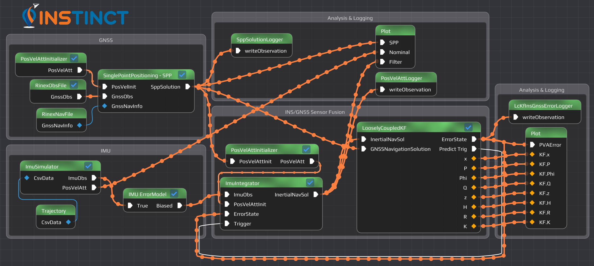

# INSTINCT - INS Toolkit for Integrated Navigation Concepts and Training

Flow-Based Navigation Software of the Institut of Navigation (INS) of the University of Stuttgart, Germany.



## Description

INSTINCT is a PNT software which implements a manifold of PNT algorithms (e.g. multi-sensor data fusion) while following the Flow-Based Programming paradigm. It can operate in real-time, interfacing to different sensors, or it can be used in post-processing mode for which data are read from files or generated from the software's own simulation tools.

The GUI provides a dataflow editor which can be used to connect Nodes (modules encapsuling functionality) and create custom-tailored applications. For performance, every Node runs in an own thread, providing parallelism out of the box.

If no GUI is required, the application can be run in ```--nogui``` mode and a `.flow` file can be loaded.

## Getting Started

### Read the documentation

Read the docs on
[](https://unistuttgart-ins.github.io/INSTINCT/)

### Working with the Repository

##### Git (either clone or update)
- Clone the repository
  ```
  git clone --recurse-submodules <URL> INSTINCT
  cd INSTINCT
  ```
- Update the repository
  ```
  git pull --recurse-submodules
  # If there where changes in the submodules
  git submodule deinit -f .    # completely "unbinds" all submodules
  git submodule update --init  # makes a fresh checkout of them
  ```

##### Build & run the main program
```shell
conan install . --build=missing -s build_type=Release -s compiler.cppstd=20
# Windows needs the argument -DCMAKE_TOOLCHAIN_FILE="build/generators/conan_toolchain.cmake"
cmake -Bbuild/Release -S. -DCMAKE_BUILD_TYPE=Release -DCMAKE_TOOLCHAIN_FILE="build/Release/generators/conan_toolchain.cmake" -DENABLE_MAIN=ON -DENABLE_TESTING=OFF -DENABLE_DOXYGEN=OFF -DENABLE_CLANG_TIDY=OFF -DENABLE_CPPCHECK=OFF -DLOG_LEVEL=INFO
cmake --build build/Release --parallel8
./build/bin/Release/instinct
```

##### Build & run the tests
```shell
conan install . --build=missing -s build_type=Release -s compiler.cppstd=20
# Windows needs the argument -DCMAKE_TOOLCHAIN_FILE="build/generators/conan_toolchain.cmake"
cmake -Bbuild/Release -S. -DCMAKE_BUILD_TYPE=Release -DCMAKE_TOOLCHAIN_FILE="build/Release/generators/conan_toolchain.cmake" -DENABLE_MAIN=OFF -DENABLE_TESTING=ON -DENABLE_DOXYGEN=OFF -DENABLE_CLANG_TIDY=OFF -DENABLE_CPPCHECK=OFF -DLOG_LEVEL=TRACE
cmake --build build/Release --parallel8
cd build/Release
ctest --output-on-failure
```

##### Build the documentation
```shell
conan install . --build=missing -s build_type=Release -s compiler.cppstd=20
# Windows needs the argument -DCMAKE_TOOLCHAIN_FILE="build/generators/conan_toolchain.cmake"
cmake -Bbuild/Release -S. -DCMAKE_BUILD_TYPE=Release -DCMAKE_TOOLCHAIN_FILE="build/Release/generators/conan_toolchain.cmake" -DENABLE_MAIN=OFF -DENABLE_TESTING=OFF -DENABLE_DOXYGEN=ON -DLOG_LEVEL=OFF -DENABLE_CLANG_TIDY=OFF -DENABLE_CPPCHECK=OFF -DENABLE_INCLUDE_WHAT_YOU_USE=OFF -DDOC_CHECK_CODE_DOCUMENTATION=NO
cmake --build build/Release --target doc
```
The doxygen main page can then be opened under `build/doc/html/index.html` (an online documentation is available on [GitHub pages](https://unistuttgart-ins.github.io/INSTINCT/))

##### Help message

```
INSTINCT - INS Toolkit for Integrated Navigation Concepts and Training

Allowed options:
  --config arg                       List of configuration files to read
                                     parameters from
  -v [ --version ]                   Display the version number
  -h [ --help ]                      Display this help message
  --sigterm                          Programm waits for -SIGUSR1 / -SIGINT /
                                     -SIGTERM
  --duration arg (=0)                Program execution duration [sec]
  --nogui                            Launch without the gui
  --noinit                           Do not initialize flows after loading them
  -l [ --load ] arg                  Flow file to load
  --rotate-output                    Create new folders for output files
  -o [ --output-path ] arg (=logs)   Directory path for logs and output files
  -i [ --input-path ] arg (=data)    Directory path for searching input files
  -f [ --flow-path ] arg (=flow)     Directory path for searching flow files
  --implot-config arg (=implot.json) Config file to read implot settings from
  --console-log-level arg (=off)     Log level on the console  (possible
                                     values: trace/debug/info/warning/error/cri
                                     tical/off
  --file-log-level arg (=debug)      Log level to the log file (possible
                                     values: trace/debug/info/warning/error/cri
                                     tical/off
  --log-filter arg                   Filter for log messages
```

### Development Environment Setup

Most library dependencies are managed by Conan.io, so you just need to install the basics.

#### ArchLinux
```shell
# Needed
sudo pacman -S --noconfirm --needed base-devel cmake clang glfw-x11
yay -S --noconfirm --needed conan # AUR package
conan profile detect --force

# Documentation
sudo pacman -S --noconfirm --needed doxygen pdf2svg texlive-most ghostscript

# Optional
sudo pacman -S --noconfirm --needed ccache cppcheck

# Profiling (optional)
sudo pacman -S --noconfirm --needed valgrind kcachegrind
```

#### Ubuntu 22.04
```shell
# Needed
sudo apt update
sudo apt upgrade -y
sudo apt install -y build-essential clang clang-tidy clang-format cmake python3-pip libglfw3-dev libglfw3
pip3 install conan --user
conan profile detect --force

# Documentation (Ubuntu 22.04 has too old doxygen version)
sudo apt install -y pdf2svg texlive texlive-lang-german texlive-latex-extra ghostscript
sudo apt install -y flex bison graphviz mscgen dia # Build dependencies
wget -c https://www.doxygen.nl/files/doxygen-1.10.0.src.tar.gz -O - | tar -xz
cd doxygen-1.10.0 && mkdir build && cd build
cmake -G "Unix Makefiles" .. && make && sudo make install

# Optional
sudo apt install ccache cppcheck

# Profiling (optional)
sudo apt install valgrind kcachegrind
```

#### MacOS
```shell
# Basic
xcode-select --install
/bin/bash -c "$(curl -fsSL https://raw.githubusercontent.com/Homebrew/install/master/install.sh)"
brew update

# Needed
brew install cmake llvm conan glfw
ln -s "$(brew --prefix llvm)/bin/clang-format" "/usr/local/bin/clang-format"
ln -s "$(brew --prefix llvm)/bin/clang-tidy" "/usr/local/bin/clang-tidy"

# Documentation
brew install doxygen pdf2svg
# Also latex is needed to compile the formulas

# Optional
brew install ccache cppcheck
```

#### Windows 11

- For development Windows Subsystem for Linux is recommended. Follow the Ubuntu instructions
- For executing, INSTINCT can be compiled with MSVC

### VSCode Configuration

#### Task overview

|  Hotkey  | Action                                       | Default       |
| :------: | :------------------------------------------- | ------------- |
| ```F5``` | Debug the project                            | Default debug |
| ```F6``` | Run Task: ```DOXYGEN: Build Documentation``` | Default build |
| ```F7``` | Run Task: ```MAIN: Build & run project```    | Default test  |
| ```F8``` | Open Task List                               |               |

* To start the GUI, execute the Task ```MAIN: Build & run project```
* If you have problems with the build, execute the Task ```CLEAN: Remove build files```
* If you want to provide tests, place them in the ```tests``` directory and execute them with the task ```TEST: Build & run```

#### Extensions

It is strongly recommended to use [Visual Studio Code](https://code.visualstudio.com/) as IDE, as the needed project files are provided in the ```.vscode``` folder.

Recommended plugins for working with this project
* [C/C++](https://marketplace.visualstudio.com/items?itemName=ms-vscode.cpptools): C/C++ IntelliSense, debugging, and code browsing.
* [CMake](https://marketplace.visualstudio.com/items?itemName=twxs.cmake): CMake langage support for Visual Studio Code
* [Doxygen Documentation Generator](https://marketplace.visualstudio.com/items?itemName=cschlosser.doxdocgen): Automatic Doxygen generation by typing ```/// + [Enter]```
* [Todo Tree](https://marketplace.visualstudio.com/items?itemName=Gruntfuggly.todo-tree): Show TODO, FIXME, etc. comment tags in a tree view
* [Code Spell Checker](https://marketplace.visualstudio.com/items?itemName=streetsidesoftware.code-spell-checker): Spelling checker for source code
* [Log File Highlighter](https://marketplace.visualstudio.com/items?itemName=emilast.LogFileHighlighter): Adds color highlighting to log files to make it easier to follow the flow of log events and identify problems.
* [Clang-Tidy](https://marketplace.visualstudio.com/items?itemName=notskm.clang-tidy) Integrates clang-tidy into VS Code
* [cmake-format](https://marketplace.visualstudio.com/items?itemName=cheshirekow.cmake-format) Format listfiles so they don't look like crap
* [mathover](https://marketplace.visualstudio.com/items?itemName=Remisa.mathover) Render LaTeX comments on hover
* [Status Bar Parameter](https://marketplace.visualstudio.com/items?itemName=mschababerle.status-bar-param) Add selectable parameter to the status bar
* [matched-line-dimmer](https://marketplace.visualstudio.com/items?itemName=ldlework.matched-line-dimmer) Visually dim lines that match regex patterns.

#### Settings

Recommended changes to the User's ```settings.json``` (**not** the project .vscode/settings.json) in case you plan to contribute to the project.
```
"editor.formatOnType": true,
"doxdocgen.generic.authorEmail": "your.name@ins.uni-stuttgart.de",
"doxdocgen.generic.authorName": "Y. Name",
```

Recommended changes to the User's ```keybindings.json```
```
[
    {
        "key": "f6",
        "command": "workbench.action.tasks.build",
        "when": "!inDebugMode"
    },
    {
        "key": "f8",
        "command": "-editor.action.marker.nextInFiles",
        "when": "editorFocus && !editorReadonly"
    },
    {
        "key": "f8",
        "command": "workbench.action.tasks.runTask"
    },
    {
        "key": "f7",
        "command": "workbench.action.tasks.test"
    }
]
```

## Dependencies

* Needed:
    * [cmake](https://cmake.org/) A cross-platform open-source make system
    * C++ compiler ([clang](https://clang.llvm.org/) or [gcc](https://gcc.gnu.org/) is recommended, but others work as well) for compiling the project
* Optional:
    * [Conan](https://conan.io) A distributed, open source, C/C++ package manager
    * [clang-format](https://clang.llvm.org/docs/ClangFormat.html) Code formatting Tool
    * [ccache](https://ccache.dev/) Compiler cache that speeds up recompilation by caching previous compilations
    * [valgrind](http://valgrind.org/) CPU profiling & leak detection
    * [kcachegrind](http://kcachegrind.sourceforge.net) Visualization of Performance Profiling Data
    * [doxygen](http://www.doxygen.nl/) Documentation system for C++, C, Java, IDL and PHP
    * [clang-tidy](https://clang.llvm.org/extra/clang-tidy/) Clang-based C++ "linter" tool
    * [cppcheck](http://cppcheck.sourceforge.net/) A tool for static C/C++ code analysis
* Libraries (Install yourself and change cmake link targets or let them automatically be installed by Conan):
    * [spdlog](https://github.com/gabime/spdlog) Fast C++ logging library [](https://opensource.org/licenses/MIT)
    * [fmt](https://github.com/fmtlib/fmt) A modern formatting library [](https://opensource.org/licenses/MIT)
    * [Boost](https://www.boost.org/) Free peer-reviewed portable C++ source libraries [](https://www.boost.org/LICENSE_1_0.txt)
    * [Eigen](http://eigen.tuxfamily.org) C++ template library for linear algebra: matrices, vectors, numerical solvers, and related algorithms [](https://opensource.org/licenses/MPL-2.0)
    * [Catch2](https://github.com/catchorg/Catch2) Modern, C++-native, header-only, test framework for unit-tests, TDD and BDD [](https://www.boost.org/LICENSE_1_0.txt)
    * [nlohmann_json](https://github.com/nlohmann/json) JSON for Modern C++ parser and generator. [](https://opensource.org/licenses/MIT)
    * [gcem](https://github.com/kthohr/gcem) GCE-Math (Generalized Constant Expression Math) is a templated C++ library enabling compile-time computation of mathematical functions. [](https://opensource.org/licenses/Apache-2.0)
    * [vnproglib](https://www.vectornav.com/resources/programming-libraries/vectornav-programming-library) VectorNav programming library [](https://opensource.org/licenses/MIT)
    * [Navio2](https://github.com/emlid/Navio2) Collection of drivers and examples for Navio 2 - autopilot shield for Raspberry Pi. [](https://opensource.org/licenses/BSD-3-Clause)
* GUI (optional):
    * [Dear ImGui](https://github.com/ocornut/imgui) Bloat-free Immediate Mode Graphical User interface for C++ with minimal dependencies [](https://opensource.org/licenses/MIT)
    * [Node Editor in ImGui](https://github.com/thedmd/imgui-node-editor) An implementation of node editor with ImGui-like API. [](https://opensource.org/licenses/MIT)
    * [ImPlot](https://github.com/epezent/implot) An immediate mode, GPU accelerated plotting library for Dear ImGui. [](https://opensource.org/licenses/MIT)
    * [ImGuiFileDialog](https://github.com/aiekick/ImGuiFileDialog) A file selection dialog built for (and using only) Dear ImGui. [](https://opensource.org/licenses/MIT)

## Authors

* [M.Sc. Thomas Topp](mailto:topp@ins.uni-stuttgart.de?subject=[INSTINCT]%20)
* [M.Sc. Marcel Maier](mailto:marcel.maier@ins.uni-stuttgart.de?subject=[INSTINCT]%20)
* [Prof. Dr. Thomas Hobiger](mailto:thomas.hobiger@ins.uni-stuttgart.de?subject=[INSTINCT]%20)
* [M.Sc. Rui Wang](mailto:rui.wang@ins.uni-stuttgart.de?subject=[INSTINCT]%20)

## License

This project is licensed under the [MPL 2.0](https://mozilla.org/MPL/2.0/) License - see the LICENSE file for details.

If this license does not suit your needs, feel free to contact us for further details.
